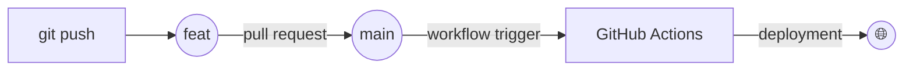

## Personal Blog | <a href="https://www.bijaykumarpun.com.np" target="_blank">www.bijaykumarpun.com.np</a>

Created using [Jekyll](https://jekyllrb.com/) & [GitHub Pages](https://pages.github.com/) using [al-folio](https://github.com/alshedivat/al-folio) theme.

# Git Workflow

## Flow

1. `git push` changes to `feat` branch 
2. Open a PR from `feat` to `main`.
3. Merge PR to `main` to trigger CI/CD workflow.
4. The workflow performs the deployment.
5. Done - Changes are now available on the web
